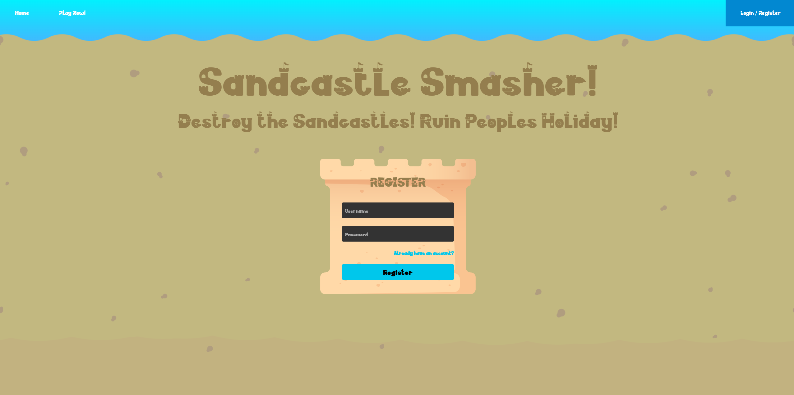
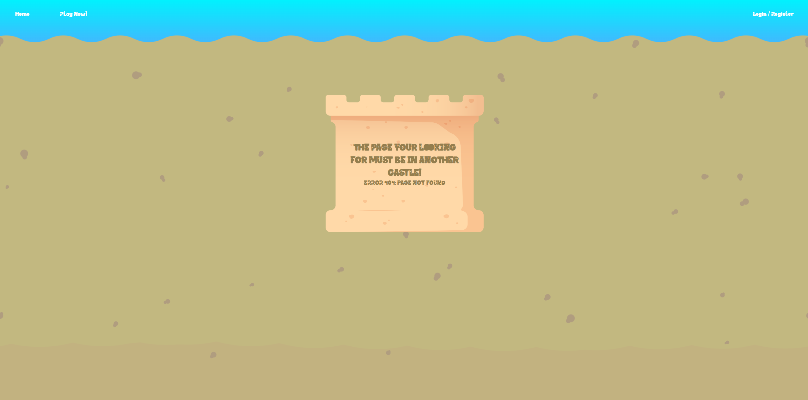
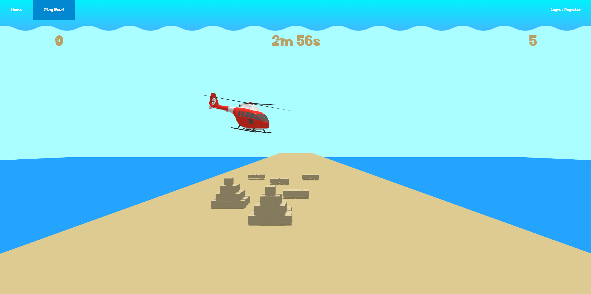

# Sandcastle Smasher!

Sandcastle Smasher is a fast-paced, browser-based game that uses THREE.js for 3D rendering and ammo.js for realistic physics. Your mission is simple: smash as many sandcastles as possible before the timer runs out!
However, be cautious—your beach balls are limited, and running out will end the game. Use your ammunition wisely, time your shots, and aim for maximum destruction to rack up the highest score before time is up!

Alongside the game there is also a website which has been created, you can find images of both the game and webpages below!

## Controls

Left Click - Shoot
Mouse - Aiming

## Game Gallery

<p float="left">
  
  
</p>

<p float="left">
  
  
</p>

## Webpage Galley

### Index Page


### Sign In & Registration Pages



### 404 Page


### Game Page



## Server

The server for the website is deployed using nodejs and the information for users is stored on a php database. This database contains ID, username, password, and score, the password is encrypted so it is stored securely.
The user remains logged in using cookies, which uses a key to keep their current session secure, as this is a project i've named it "TEMP_KEY" as it is all for testing is not for actual use!

## Project Structure
```
myGame://
|   app.js
|
+---secure
|       database.json
|
\---static
    |   401page.html
    |   404page.html
    |   game.html
    |   index.html
    |   login.html
    |   register.html
    |
    \---resources
        +---ammo
        |       ammo.js
        |       three.core.js
        |       three.module.js
        |
        +---audio
        |       BackgroundMusic.mp3
        |       Ocean.mp3
        |       Pop.wav
        |       Sand.wav
        |       Seagulls.mp3
        |
        +---css
        |       style.css
        |
        +---images
        |       beachballs.jpg
        |       GameImgFour.png
        |       GameImgOne.png
        |       GameImgThree.png
        |       GameImgTwo.png
        |       HowToPlayFour.png
        |       HowToPlayOne.png
        |       HowToPlayThree.png
        |       HowToPlayTwo.png
        |       SandcastleBox.png
        |       Website_BG.png
        |
        +---js
        |       countdowntimer.js
        |       game.js
        |       splashscreen.js
        |       tutorialsessions.js
        |
        +---models
        |       beach_ball.glb
        |       low_poly_helicopter.glb
        |
        \---text
                SANDCASTLE.otf
                SANDCASTLE.ttf

```
